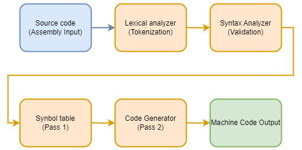
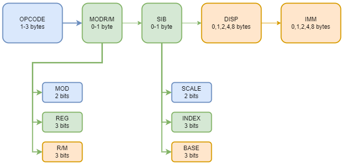
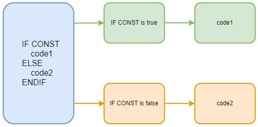

# x86 Assembler Implementation (Two-Pass Compiler in C++)

**Watch the project videos on YouTube:**

🇺🇦 [Ukrainian version](https://www.youtube.com/watch?v=14DGt2ue0EQ&t=350s)

## Overview

This project is a custom implementation of an x86 assembler built in C++ using a classical two-pass compilation model.

Unlike simplified academic assemblers, this project focuses on **instruction encoding at the byte level**, including ModR/M and partial SIB handling, as well as architectural constraints of x86 processors.

The project demonstrates deep understanding of:
- instruction encoding
- addressing modes
- register architecture
- compiler design

---

## Core Concepts Demonstrated



### 1. Two-Pass Compilation Model
- **Pass 1**:
  - lexical + syntax analysis
  - symbol table construction
  - label resolution
- **Pass 2**:
  - instruction encoding
  - displacement calculation
  - final machine code generation

---

### 2. Instruction Encoding (x86 Internals)



The assembler generates machine code manually based on x86 instruction format:

- Opcode
- Mod-Reg-R/M byte
- Displacement
- Immediate values
- Partial support of SIB byte (base, index; scale not implemented)

I implemented encoding logic using knowledge of:
- **ModR/M byte structure**
- **register binary mapping**
- **addressing modes**

---

### 3. Addressing Modes & Architecture Constraints

The project reflects real x86 limitations:

- 16-bit addressing restrictions (limited register combinations)
- register availability depending on operand size
- memory addressing via `[base + index + displacement]`

Special attention is given to:
- how registers map into binary encoding
- how addressing affects instruction size

---

### 4. Register-Level Understanding

The implementation is based on detailed knowledge of x86 registers:

- General purpose registers (EAX, EBX, etc.)
- Sub-registers (AH, AL inside EAX)
- Segment registers
- Register encoding depending on operand size (8/16/32-bit)

---

### 5. Conditional Compilation Support



The assembler supports basic compile-time directives:

- `IF`, `ELSE`, `ENDIF`

This allows:
- conditional inclusion of code
- simple macro-like behavior

---

### 6. Error Detection and Reporting

The compiler not only detects errors but also provides **explicit diagnostics**:

- syntax errors
- unsupported constructs
- invalid operands
- undefined symbols

This mimics real assembler behavior rather than silently failing.

---

### 7. Documentation-Driven Development

The implementation is based on studying official x86 documentation:

- instruction formats
- encoding rules
- opcode tables

This project reflects the ability to:
- read and interpret low-level architecture manuals
- apply them in practice

---

### 8. Tooling and Debugging Approach

During development I used:

- programmer calculators (for hex/binary conversions)
- manual encoding verification
- comparison with Turbo Assembler (TASM)

---

## Project Structure

- `LexicalAnalyzer` – tokenization
- `Instruction` – instruction model
- `Operand` – operand parsing and validation
- `Opcode` – encoding logic
- `Data` – data segment handling
- `Error` – error system

---

## Example

### Input
```asm
mov eax, 20
add eax, ebx
jbe next
```

### Output

```
B8 00000014
03 C3
76 0E
```

---

## Validation

The output was verified against Turbo Assembler (TASM):
- instruction encoding matches
- symbol resolution is correct
- memory layout is consistent

---

## Limitations
- SIB byte: SCALE field not implemented
- limited instruction set
- simplified directive system

---

## What This Project Demonstrates
This project is not just an assembler implementation, but proof of:
- deep understanding of **computer architecture**
- ability to work with **low-level binary encoding**
- knowledge of **compiler design principles**
- ability to read and apply **technical documentation**